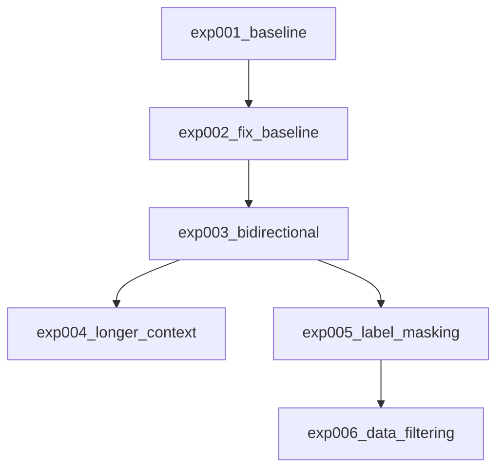

# 実験サマリー

## 実験系譜図

## 実験一覧

| 実験 | 概要 | CV (training eval) | CV (inference greedy) | Public LB | 主な知見 |
|------|------|--------------------|-----------------------|-----------|----------|
| exp001_baseline | ByT5-small + 固定padding + 正規化 + 双方向 | 19.25 | 未計測 | - | 文アライメント未機能、固定paddingが有害 |
| exp002_fix_baseline | 動的padding + 正規化なし + 単方向 | 21.16 | 未計測 | - | padding/正規化修正の効果確認 |
| exp003_bidirectional | Starter再現: 双方向学習ON + 最終epoch使用 | 23.55 | **17.87** (doc) / **26.19** (sent) | - | training eval水増し発見。beam4=14.37 |
| exp004_longer_context | max_length拡大(入力1024/出力2048) + best model + wandb | 10.69 | **10.68** (greedy) / **14.00** (beam4+post) | - | max_length拡大で悪化。training eval乖離は解消 |
| exp005_label_masking | 英語ラベル文末マスキング + 逆方向encoder=1024 | 23.72 | **18.28** (doc) / **27.03** (sent) | - | +0.41pt改善。文レベルCV=27.03 |
| exp006_data_filtering | 外れ値除去(ratio<0.3/>5) + 後処理最適化(repeated_removalのみ) | - | - | - | 学習中 |

**注意**: training eval CVはByT5の512バイトtruncationにより参照テキストが切り詰められ水増しされる。inference greedyが正確なCV。

## Key Findings

### データに関する知見

- trainデータの文アライメント（改行ベース分割）は行数一致ケースが少なく機能しない（1561→1561行のまま）
- Sentences_Oare.csvの活用が文レベルデータ獲得の鍵
- **StarterはSentences_Oare.csv未使用**（train.csvのみ）
- 双方向学習（Eng→Akk逆翻訳追加）で+2.39pt改善

### モデルに関する知見

- ByT5-small: 19.25→21.16→23.55と段階的に改善
- Adafactor + lr=1e-4 + label_smoothing=0.2 は安定
- FP32必須（FP16はByT5でNaN）
- epoch 17-19 で収束（双方向学習の場合）
- **最終epochが必ずしもベストではない**: epoch 19(24.22) > epoch 20(23.55)

### 前処理・後処理に関する知見

- **正規化なしが正解**（Starterは正規化なし）
- 動的パディング必須
- **training evalのCVはtruncation水増し**: 正確なCVはinference greedy（exp003: 17.87 vs training eval 23.55）
- **文レベルCV（sent-level）がテスト条件に最も近い**: doc-level=18.28 vs sent-level=27.03（exp005）。今後はsent-level CVを標準指標とする
- beam search(14.37)はgreedy(17.87)より低い: ByT5の長文繰り返し問題（テストは短文なので影響小）
- no_repeat_ngram_sizeはByT5バイトレベルでは使えない（3-gram=1-2文字で壊滅的）

## 有効なテクニック

- ByT5のバイトレベルトークナイゼーション
- DataCollatorForSeq2Seqによる動的パディング
- 双方向学習（Akk→Eng + Eng→Akk）で+2.39pt

## 避けるべきアプローチ

- 単純な改行ベース文アライメント（trainデータに改行が存在しないため無効）
- `padding="max_length"` でのトークナイズ（ByT5は動的パディング必須）
- `Ḫ→H`等の正規化（アッカド語の音素区別を破壊）
- ビームサーチ時にno_repeat_ngram_sizeなしでの推論（繰り返し出力が深刻）

## Changelog

| 日付 | 内容 |
|------|------|
| 2026-03-03 | プロジェクト初期化、exp001_baseline 作成 |
| 2026-03-07 | exp001_baseline 学習完了: geo_mean=19.25 |
| 2026-03-07 | exp002_fix_baseline 学習完了: geo_mean=21.16 (+1.91pt) |
| 2026-03-07 | exp003_bidirectional 学習完了: geo_mean=23.55 (+2.39pt)。beam search繰り返し問題発見 |
| 2026-03-07 | exp004_longer_context 学習完了: greedy=10.68, beam4+post=14.00。max_length拡大で悪化。training eval乖離は解消 |
| 2026-03-08 | exp005_label_masking 学習完了: greedy=18.28 (+0.41pt vs exp003)。文レベルCV=27.03導入 |
