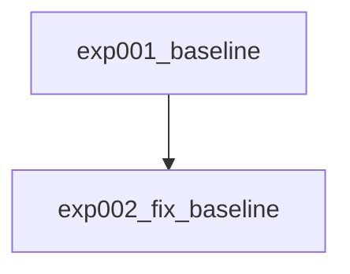

# 実験サマリー

## 実験系譜図

## 実験一覧

| 実験 | 概要 | CV Score | Public LB | Private LB | 主な知見 |
|------|------|----------|-----------|------------|----------|
| exp001_baseline | ByT5-small + 双方向学習 | geo_mean=19.25 (chrF=32.02, BLEU=11.57) | - | - | 文アライメント未機能、双方向学習の効果不明、epoch16-18で収束 |
| exp002_fix_baseline | exp001バグ修正: 動的padding + 正規化なし + 単方向 | geo_mean=21.16 (chrF=32.91, BLEU=13.60) | - | - | +1.91pt改善。~30未達はSentences_Oare未使用が主因か |

## Key Findings

### データに関する知見

- trainデータの文アライメント（改行ベース分割）は行数一致ケースが少なく機能しない（1561→1561行のまま）
- Sentences_Oare.csvの活用が文レベルデータ獲得の鍵
- **Starterの報告値~30はSentences_Oare.csv追加（1561→11343件、7x増）込みの結果である可能性が高い**

### モデルに関する知見

- ByT5-small: geo_mean=19.25→21.16（動的padding+正規化なしで+1.91pt）
- Adafactor + lr=1e-4 + label_smoothing=0.2 は安定して学習可能
- FP32で学習（FP16はByT5でNaN頻発）
- epoch 15-17 で収束、以降改善なし（exp001/exp002で共通パターン）

### 前処理・後処理に関する知見

- **正規化なしが正解**（Ḫ/ḫ正規化は有害。Starterは正規化なし）
- 動的パディングは必須（固定paddingより+1.91pt）
- 双方向学習OFF + trainデータのみでgeo_mean=21.16

## 有効なテクニック

- ByT5のバイトレベルトークナイゼーションはアッカド語に適合
- DataCollatorForSeq2Seqによる動的パディング

## 避けるべきアプローチ

- 単純な改行ベース文アライメント（trainデータに改行が存在しないため完全に無効）
- **`padding="max_length"` でのトークナイズ** — ByT5は動的パディング(DataCollator委任)必須
- **`Ḫ→H`等の正規化** — アッカド語で意味のある音素区別を潰す。Starterは正規化なし
- 英語翻訳テキストへの正規化適用（不要・有害）

## Changelog

| 日付 | 内容 |
|------|------|
| 2026-03-03 | プロジェクト初期化、exp001_baseline 作成 |
| 2026-03-07 | exp001_baseline 学習完了: geo_mean=19.25 (chrF=32.02, BLEU=11.57) |
| 2026-03-07 | exp002_fix_baseline 学習完了: geo_mean=21.16 (chrF=32.91, BLEU=13.60)。+1.91pt改善 |
