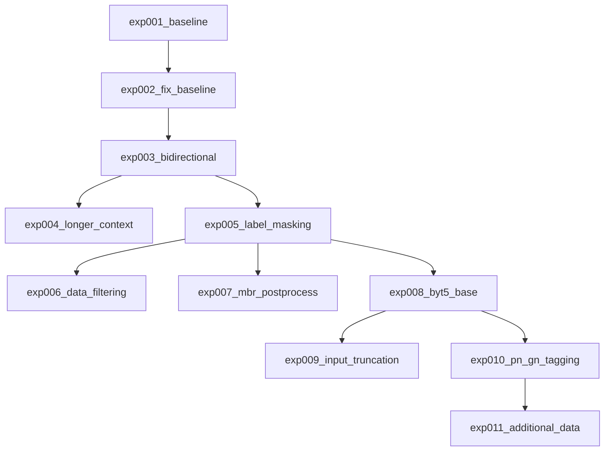

# 実験サマリー

## 実験系譜図

## 実験一覧

| 実験 | 概要 | CV (training eval) | CV (inference greedy) | Public LB | 主な知見 |
|------|------|--------------------|-----------------------|-----------|----------|
| exp001_baseline | ByT5-small + 固定padding + 正規化 + 双方向 | 19.25 | 未計測 | - | 文アライメント未機能、固定paddingが有害 |
| exp002_fix_baseline | 動的padding + 正規化なし + 単方向 | 21.16 | 未計測 | - | padding/正規化修正の効果確認 |
| exp003_bidirectional | Starter再現: 双方向学習ON + 最終epoch使用 | 23.55 | **17.87** (doc) / **26.19** (sent) | - | training eval水増し発見。beam4=14.37 |
| exp004_longer_context | max_length拡大(入力1024/出力2048) + best model + wandb | 10.69 | **10.68** (greedy) / **14.00** (beam4+post) | - | max_length拡大で悪化。training eval乖離は解消 |
| exp005_label_masking | 英語ラベル文末マスキング + 逆方向encoder=1024 | 23.72 | **18.28** (doc) / **27.03** (sent) | - | +0.41pt改善。文レベルCV=27.03 |
| exp006_data_filtering | 外れ値除去(ratio<0.3/>5) + 後処理最適化(repeated_removalのみ) | 23.64 | **18.61** (doc) / **25.17** (sent) | - | 棄却。sent-1.86pt悪化。予測長増加が主因 |
| exp007_mbr_postprocess | MBRデコーディング + OA_Lexicon後処理 + repeated_removal | - | greedy=26.56/**MBR=27.31**(sent推論) | - | **MBR sent +0.75pt**。後処理は中立。繰り返し43%に低減 |
| exp008_byt5_base | ByT5-base + cosine scheduler + BF16 | 24.33 | **28.14** (greedy) / **28.94** (MBR) | - | **MBR +1.63pt vs exp007**。BF16安定。繰り返し45% |
| exp009_input_truncation | 確率的入力truncation augmentation (50%でAkk先頭200B) | 21.70 | **24.11** (greedy) / **29.08** (MBR) | - | MBR +0.14pt微増。greedy-4.03pt悪化。繰り返し増加 |
| exp010_pn_gn_tagging | OA_LexiconでPN/GNタグ付加 | 25.55 | **28.96** (greedy) / **28.57** (MBR) / **29.92** (greedy_clean) | - | **greedy_clean=29.92がベスト**。繰り返し率大幅改善(MBR 51→41%) |
| exp011_additional_data | Sentences_Oare+published_textsで+1,165件追加 | 31.77 | **33.13** (greedy) / **31.54** (MBR) / **33.45** (greedy_clean) | - | **greedy_clean=33.45（+3.53pt）**。データ+83%で大幅改善。繰り返し30.6% |

**注意**: training eval CVはByT5の512バイトtruncationにより参照テキストが切り詰められ水増しされる。inference greedyが正確なCV。

## Key Findings

### データに関する知見

- trainデータの文アライメント（改行ベース分割）は行数一致ケースが少なく機能しない（1561→1561行のまま）
- Sentences_Oare.csvの活用が文レベルデータ獲得の鍵
- **StarterはSentences_Oare.csv未使用**（train.csvのみ）
- 双方向学習（Eng→Akk逆翻訳追加）で+2.39pt改善

### モデルに関する知見

- ByT5-small: 19.25→21.16→23.55と段階的に改善
- **ByT5-base: sent MBR=28.94（+1.63pt vs small）**。モデルスケールアップの効果大
- **PN/GNタグ付加: greedy_clean=29.92（全実験ベスト）**。繰り返し率41%に改善。固有名詞マーキングが有効
- Adafactor + lr=1e-4 (small) / 5e-5 (base) + label_smoothing=0.2 は安定
- **BF16はRTX4090で安定動作**（FP16はByT5でNaN）
- epoch 17-19 で収束（双方向学習の場合）
- **最終epochが必ずしもベストではない**: epoch 19(24.22) > epoch 20(23.55)

### 推論に関する知見

- **MBRデコーディングはsent推論で+0.75pt改善**（beam8→4 + sampling2, chrF++選択。26.56→27.31）
- doc推論→1文抽出では+1.65ptだが、テスト条件（文レベル入力）とは異なる
- **後処理（OA_Lexicon + TM + repeated_removal）はMBR上では中立**、greedy上では+1.35pt
- Translation Memory: train splitのみで24.8% hit。完全一致時は正確
- **繰り返し問題が最大の課題**: greedy 80.9%→50.3%（exp010）、MBR 61.8%→41.4%（exp010）。PN/GNタグで大幅改善

### 前処理・後処理に関する知見

- **正規化なしが正解**（Starterは正規化なし）
- 動的パディング必須
- **training evalのCVはtruncation水増し**: 正確なCVはinference greedy（exp003: 17.87 vs training eval 23.55）
- **文レベルCV（sent-level）がテスト条件に最も近い**: doc-level=18.28 vs sent-level=27.03（exp005）。今後はsent-level CVを標準指標とする
- beam search(14.37)はgreedy(17.87)より低い: ByT5の長文繰り返し問題（テストは短文なので影響小）
- no_repeat_ngram_sizeはByT5バイトレベルでは使えない（3-gram=1-2文字で壊滅的）

## 有効なテクニック

- ByT5のバイトレベルトークナイゼーション
- DataCollatorForSeq2Seqによる動的パディング
- 双方向学習（Akk→Eng + Eng→Akk）で+2.39pt

## 避けるべきアプローチ

- 単純な改行ベース文アライメント（trainデータに改行が存在しないため無効）
- `padding="max_length"` でのトークナイズ（ByT5は動的パディング必須）
- `Ḫ→H`等の正規化（アッカド語の音素区別を破壊）
- ビームサーチ時にno_repeat_ngram_sizeなしでの推論（繰り返し出力が深刻）

## 将来の実験案

### データ拡充: publications.csvからの大規模追加データ構築（公式推奨ワークフロー）

公式コメントによると、publications.csv（900 PDFのOCRテキスト、216K行）から翻訳ペアを抽出するのが本命のデータ拡充手段。

**公式推奨ワークフロー:**
1. **翻字と翻訳のマッチング**: 文書ID・alias・museum numberを使い、OCRテキスト中の翻字と翻訳を対応付け
2. **多言語→英語変換**: OCRテキストには英語・ドイツ語・フランス語・トルコ語等が混在 → LLMで英語に統一
3. **文レベルアライメント**: アッカド語翻字と英語翻訳をsentence単位でペアリング

**規模**: 潜在的に数千〜数万件の追加ペア（現在の+1,165件を大幅に超える可能性）
**難易度**: 高（OCRノイズ、多言語処理、文アライメントの精度）
**期待効果**: データ量が根本的に増えるため、大幅な精度向上が見込める

### その他の候補

- **Model Soup**: exp008/exp010/exp011のモデル重み平均。推論コストゼロでアンサンブル効果（+0.5〜1pt期待）
- **Cross-model MBR**: 複数モデルの候補をプールしてMBR選択。トップLBとの主な差分（+1〜3pt期待）
- **AICC機械翻訳6,141件をnoisy labelとして追加**: published_textsのAICC_translationカラム。品質未検証
- **MBRパラメータ調整**: 現在のMBRは出力が短すぎる（mean 128文字 vs ref 166文字）。候補生成の多様性を上げる
- **ByT5-large フルFT**: 1.2B params、VRAM要検討

## Changelog

| 日付 | 内容 |
|------|------|
| 2026-03-03 | プロジェクト初期化、exp001_baseline 作成 |
| 2026-03-07 | exp001_baseline 学習完了: geo_mean=19.25 |
| 2026-03-07 | exp002_fix_baseline 学習完了: geo_mean=21.16 (+1.91pt) |
| 2026-03-07 | exp003_bidirectional 学習完了: geo_mean=23.55 (+2.39pt)。beam search繰り返し問題発見 |
| 2026-03-07 | exp004_longer_context 学習完了: greedy=10.68, beam4+post=14.00。max_length拡大で悪化。training eval乖離は解消 |
| 2026-03-08 | exp005_label_masking 学習完了: greedy=18.28 (+0.41pt vs exp003)。文レベルCV=27.03導入 |
| 2026-03-08 | exp007_mbr_postprocess 完了: MBR sent推論=27.31 (+0.75pt)。後処理は中立。sent入力で繰り返し43%に低減 |
| 2026-03-08 | exp008_byt5_base 完了: MBR sent=28.94 (+1.63pt)。ByT5-baseスケールアップ成功。cosine+BF16安定 |
| 2026-03-08 | exp009_input_truncation 完了: MBR sent=29.08 (+0.14pt)。入力truncation augは効果限定的。greedy悪化(-4.03pt)、繰り返し増加 |
| 2026-03-09 | exp010_pn_gn_tagging 完了: greedy_clean=29.92（全実験ベスト）。PN/GNタグで繰り返し41%に改善 |
| 2026-03-09 | exp011_additional_data 完了: greedy_clean=33.45（+3.53pt）。Sentences_Oare追加データ+83%で大幅改善。繰り返し30.6% |
