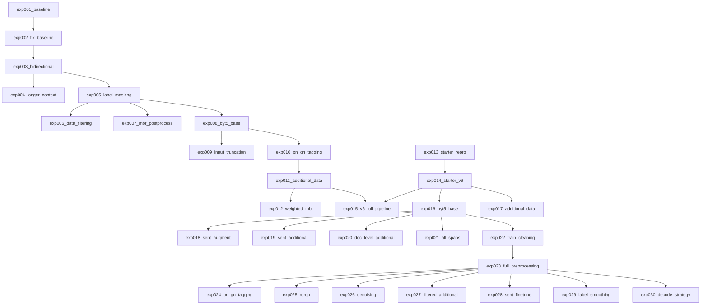

# 実験サマリー

## 実験系譜図

## 実験一覧

| 実験 | 概要 | CV (training eval) | CV (inference greedy) | Public LB | 主な知見 |
|------|------|--------------------|-----------------------|-----------|----------|
| exp001_baseline | ByT5-small + 固定padding + 正規化 + 双方向 | 19.25 | 未計測 | - | 文アライメント未機能、固定paddingが有害 |
| exp002_fix_baseline | 動的padding + 正規化なし + 単方向 | 21.16 | 未計測 | - | padding/正規化修正の効果確認 |
| exp003_bidirectional | Starter再現: 双方向学習ON + 最終epoch使用 | 23.55 | **17.87** (doc) / **26.19** (sent) | - | training eval水増し発見。beam4=14.37 |
| exp004_longer_context | max_length拡大(入力1024/出力2048) + best model + wandb | 10.69 | **10.68** (greedy) / **14.00** (beam4+post) | - | max_length拡大で悪化。training eval乖離は解消 |
| exp005_label_masking | 英語ラベル文末マスキング + 逆方向encoder=1024 | 23.72 | **18.28** (doc) / **27.03** (sent) | - | +0.41pt改善。文レベルCV=27.03 |
| exp006_data_filtering | 外れ値除去(ratio<0.3/>5) + 後処理最適化(repeated_removalのみ) | 23.64 | **18.61** (doc) / **25.17** (sent) | - | 棄却。sent-1.86pt悪化。予測長増加が主因 |
| exp007_mbr_postprocess | MBRデコーディング + OA_Lexicon後処理 + repeated_removal | - | greedy=26.56/**MBR=27.31**(sent推論) | - | **MBR sent +0.75pt**。後処理は中立。繰り返し43%に低減 |
| exp008_byt5_base | ByT5-base + cosine scheduler + BF16 | 24.33 | **28.14** (greedy) / **28.94** (MBR) | - | **MBR +1.63pt vs exp007**。BF16安定。繰り返し45% |
| exp009_input_truncation | 確率的入力truncation augmentation (50%でAkk先頭200B) | 21.70 | **24.11** (greedy) / **29.08** (MBR) | - | MBR +0.14pt微増。greedy-4.03pt悪化。繰り返し増加 |
| exp010_pn_gn_tagging | OA_LexiconでPN/GNタグ付加 | 25.55 | **28.96** (greedy) / **28.57** (MBR) / **29.92** (greedy_clean) | - | **greedy_clean=29.92がベスト**。繰り返し率大幅改善(MBR 51→41%) |
| exp011_additional_data | Sentences_Oare+published_textsで+1,165件追加 | 31.77 | **33.13** (greedy) / **31.54** (MBR) / **33.45** (greedy_clean) | greedy=20.0, MBR=23.8 | **greedy_clean=33.45（+3.53pt）**。データ+83%で大幅改善。繰り返し30.6% |
| exp012_weighted_mbr | MBR候補プール拡張・スコアリング・greedy全10バリエーションのグリッドサーチ | - | **34.47** (13候補chrF++ MBR) / 33.45 (greedy_clean) | - | **候補プール拡張が最重要（+1.02pt）**。weighted MBRは逆効果。beam数増はNG |
| exp013_starter_repro | Starter latest版再現（lr=1e-4, LS=0.2）| 25.62 | **32.04** (beam4 sent) | 21.6 | ピン留め版(v6)とは設定が異なっていた。CV/LB比=1.48 |
| exp014_starter_v6 | Starter v6ピン留め版再現（lr=2e-4, LS=0, batch=4×2）| 37.47 | **39.89** (beam4 sent) | 26.9 | starter LB=26に近い再現。CV/LB比=1.48 |
| exp015_v6_full_pipeline | exp014(v6設定) + exp011(ByT5-base, PN/GN, 追加データ, cosine, BF16) | 48.44 | **43.26** (beam4 sent, chrF++) | 27.3 | CV/LB比=0.63に悪化。CV+3.4ptがLB+0.4ptにしかならず |
| exp016_byt5_base | exp014 + ByT5-baseのみ（タグ・追加データなし、BF16） | 46.73 | **45.78** (beam4 sent, clean) | **29.5** | **LB/CVベスト**。CV/LB比=1.55。モデルサイズアップが最も有効 |
| exp017_additional_data | exp014 + 追加データのみ（ByT5-small、タグなし） | 41.10 | **42.20** (beam4 sent, clean) | 25.4 | CV+2.31ptだが**LB-1.5pt**。追加データはLBで逆効果 |
| exp018_sent_augment | exp016 + 確率的開始位置シフトaugment（6文以下doc対象） | 45.33 | **45.37** (beam4 sent, clean) | - | exp016比-0.41pt。効果なし。512B内に大部分収まるため |
| exp019_sent_additional | exp016 + sentence_aligned 2文目以降追加 | 48.49 | **46.44** (beam4 sent, clean) | **28.7** | **LB exp016比-0.8pt**。CV改善がLBに繋がらず |
| exp020_doc_level_additional | exp016 + 開始位置ずらしdoc-level追加 | 47.46 | **44.26** (beam4 sent, clean) | **26.2** | sent-CV=38.87, doc-CV=26.62。LB -3.3pt悪化 |
| exp021_all_spans | exp016 + 全連続部分列追加 | 47.37 | **45.24** (beam4 sent, clean) | **26.5** | sent-CV=40.51（CV最良）だがLB -3.0pt悪化 |
| exp022_train_cleaning | exp016 + Host推奨train前処理（(?)/PN除去、小数→分数、ローマ数字→整数、Ḫ→H等） | 49.01 | **47.09** (beam4 sent, clean) | **30.1** | **LBベスト更新**。exp016比CV+1.31pt,LB+0.6pt。小数変換に丸め誤差対応の余地あり |
| exp023_full_preprocessing | exp022 + eda022全改善（近似小数、月名→番号、regex修正、gap重複、(ki)対応） | 48.50 | **46.85** (beam4 sent, clean) | **30.03** | LB横ばい(exp022=30.1)。前処理網羅性UPだがLB効果なし |
| exp024_pn_gn_tagging | exp023 + OA_LexiconベースPN/GNタグ付加 | 47.52 | **44.62** (beam4 sent, clean) | - | exp023比-2.23pt悪化。棄却 |
| exp025_rdrop | exp023 + R-Drop正則化 | - | - | - | OOM+BF16 NaN。断念 |
| exp026_denoising | exp023 + Denoising Augmentation（文字ノイズ50%） | 42.92 | sent-geo=33.55, doc-geo=23.21 (fold3) | - | **棄却**。sent -1.89pt, doc -2.31pt悪化 |
| exp027_filtered_additional | exp023 + フィルタ済み追加データ(778件) | 44.20 | sent-geo=35.45, doc-geo=24.06 (fold3) | - | **中立〜微悪化**。sent +0.01pt, doc -1.46pt。追加データ路線は効果なし |
| exp028_sent_finetune | exp023 fold3 last_model → sentence_aligned.csv(2311行)で2段階fine-tune。lr=5e-5, 5epochs | 39.76 | sent-geo=35.40, doc-geo=19.37 (fold3) | - | **棄却**。doc-geo -6.15pt、rep=56.2%。短文fine-tuneで長文生成能力崩壊 |
| exp029_label_smoothing | exp023 + label_smoothing_factor=0.1 | 43.63 | sent-geo=34.88, doc-geo=23.84 (fold3) | - | **棄却**。sent -0.56pt, doc -1.68pt。rep=70%。ByT5でlabel smoothingは逆効果 |
| exp030_decode_strategy | デコード戦略グリッドサーチ（greedy/beam/rp/lp/MBR）。exp023 fold3 last_model | - | **MBR multi-temp geo=35.51**, greedy=35.35, beam4=34.05 (fold3 sent-CV) | - | **MBR multi-temp(0.6/0.8/1.05)がベスト**。greedyがbeam全設定を上回る。MBRのみgreedy超え(+0.16pt) |

**注意**: training eval CVはByT5の512バイトtruncationにより参照テキストが切り詰められ水増しされる。inference greedyまたはbeam4 sentが正確なCV。また`evaluate.load("chrf")`はデフォルトword_order=0(chrF)でありコンペのchrF++(word_order=2)とは異なる。

### CV評価方針（eda020で確定、exp020以降適用）

従来の「200B截断+1文抽出」CVはLBと乖離が大きかった（CV/LB=1.55-1.66）。
**今後はsent-CV + doc-CV（切り詰めなし）の2軸で評価する。**

- **sent-CV**: sentence_aligned.csvで6文以下のvalドキュメントを文分割 → 文単位で推論・評価
- **doc-CV**: valドキュメント全体を入力し全文翻訳と比較（截断なし）。繰り返し耐性・汎化力を測る
- **重要**: 学習時に前処理を適用した実験（exp022以降）は、評価時にも同じ前処理を適用する必要がある（`--preprocess`オプション）

| 実験 | sent-CV (geo) | doc-CV (geo) | LB | sent/LB | doc/LB | 備考 |
|------|-------------|-------------|-----|---------|--------|------|
| exp015 | 37.89 | 30.98 | 27.3 | 1.39 | 1.13 | |
| exp016 | 36.95 | 25.41 | 29.5 | 1.25 | 0.86 | |
| exp017 | 31.27 | 20.08 | 25.4 | 1.23 | 0.79 | |
| exp018 | 36.72 | 24.45 | - | - | - | |
| exp019 | 39.50 | 27.21 | 28.7 | 1.38 | 0.95 | |
| exp020 | 38.87 | 26.62 | 26.2 | 1.48 | 1.02 | |
| exp021 | 40.51 | 26.89 | 26.5 | 1.53 | 1.01 | |
| exp022 | - | - | 30.1 | - | - | 未計測 |
| exp023 | 36.34 | 25.84 | 30.03 | 1.21 | 0.86 | prep=exp023で再計測 |

※ sent-CV: 57 val docs → 189 sentences、doc-CV: 157 val docs（全件）。評価スクリプト: `eda/eda020_sent_level_cv/eval_full_doc.py`
※ exp023以前の旧スコア（前処理なし）: sent-CV=34.35, doc-CV=24.87。前処理ミスマッチで過小評価されていた

### GroupKFold検証（AKTグループ, 5-fold, 全fold実施）

AKT出版グループ(7グループ)でGroupKFold(n_splits=5)。評価はlast_modelで実施。

fold別val分布:
- Fold 0: val=363 (AKT 8)
- Fold 1: val=300 (AKT 6a)
- Fold 2: val=266 (AKT 6e + None)
- Fold 3: val=297 (AKT 6b + AKT 5)
- Fold 4: val=335 (AKT 6c + AKT 6d)

#### 全fold結果

| exp | fold | val groups | train_loss | eval_loss | 学習eval_geo | eval_full sent-geo | eval_full doc-geo |
|-----|------|-----------|-----------|----------|-------------|-------------------|------------------|
| exp023 | fold0 | AKT 8 | 0.174 | 0.685 | 34.33 | 25.96 | 24.05 |
| exp023 | fold1 | AKT 6a | 0.234 | 0.435 | 43.99 | 42.13 | 23.91 |
| exp023 | fold2 | AKT 6e+None | 0.191 | 0.420 | 35.84 | 40.67 | 33.42 |
| exp023 | fold3 | AKT 6b+AKT 5 | 0.157 | 0.508 | 43.73 | 35.44 | 25.52 |
| exp023 | fold4 | AKT 6c+AKT 6d | 0.194 | 0.449 | 45.67 | 40.07 | 34.03 |
| **exp023** | **mean** | | | | **40.71** | **36.85** | **28.19** |
| exp019 | fold0 | AKT 8 | 0.136 | 0.775 | 34.14 | 28.95 | 24.59 |
| exp019 | fold1 | AKT 6a | 0.139 | 0.488 | 44.32 | 44.28 | 23.96 |
| exp019 | fold2 | AKT 6e+None | 0.148 | 0.496 | 35.84 | 43.23 | 35.12 |
| exp019 | fold3 | AKT 6b+AKT 5 | 0.133 | 0.581 | 42.97 | 37.80 | 24.97 |
| exp019 | fold4 | AKT 6c+AKT 6d | 0.149 | 0.492 | 44.88 | 42.45 | 35.43 |
| **exp019** | **mean** | | | | **40.43** | **39.34** | **28.82** |

#### LBとの相関

| metric | exp023 | exp019 | LB順序(exp023>exp019)と一致？ |
|--------|--------|--------|------------------------------|
| 学習eval_geo mean | 40.71 | 40.43 | **一致**（差0.28pt、ほぼ誤差範囲） |
| eval_full sent-CV mean | 36.85 | 39.34 | 不一致（exp019が+2.49pt上） |
| eval_full doc-CV mean | 28.19 | 28.82 | 不一致（exp019が+0.63pt上） |
| LB | 30.03 | 28.7 | - |

#### Fold3 実験比較（exp023ベースの改善試行）

| exp | 変更点 | train_loss | eval_loss | 学習eval_geo | eval_full sent-geo | eval_full doc-geo |
|-----|--------|-----------|----------|-------------|-------------------|------------------|
| exp019 | +sent追加データ(未フィルタ) | 0.133 | 0.581 | 42.97 | 37.80 | 24.97 |
| exp023 | ベースライン(前処理のみ) | 0.157 | 0.508 | 43.73 | 35.44 | 25.52 |
| exp026 | +Denoising(文字ノイズp=0.1) | 0.170 | 0.515 | 42.92 | 33.55 | 23.21 |
| exp027 | +フィルタ済み追加データ(778件) | 0.161 | 0.491 | 43.96 | 35.45 | 24.06 |

- exp026: 文字ノイズで全指標悪化。train_lossも上がり学習自体が妨害されている
- exp027: 学習eval_geoは微改善(+0.23pt)だがeval_full sent-geoは横ばい、doc-geoは-1.46pt悪化
- exp019: sent-geoは最良(37.80)だがdoc-geoはexp023より低い。LBも-1.3pt悪い

#### 知見
- **ランダム分割にリークあり**: GKFでsent-CVが10pt以上低下
- **学習eval_geoのみがLB順序と一致**するが、差は微小で信頼性は不十分
- **fold間ばらつきが大きい**: doc-CV std=4.5-5.3pt。fold0,1が低く(24前後)、fold2,4が高い(33-35)
- **文書タイプの距離とスコアは無相関**: AKT 6e（train側と最も遠い）がdoc-CV最高。AKT 6a（同系統の手紙型がtrainに豊富）がdoc-CV最低。各AKTグループ固有の難易度による
- **exp019はtrain_lossが低い(0.13台)がeval_lossは高い**: 追加データでフィットが進むが汎化には繋がらず過学習が進行
- **fold0（AKT 8）のeval_lossが突出**(0.685/0.775): 他foldの1.5倍以上

## Key Findings

### データに関する知見

- trainデータの文アライメント（改行ベース分割）は行数一致ケースが少なく機能しない（1561→1561行のまま）
- Sentences_Oare.csvの活用が文レベルデータ獲得の鍵
- **StarterはSentences_Oare.csv未使用**（train.csvのみ）
- 双方向学習（Eng→Akk逆翻訳追加）で+2.39pt改善

### モデルに関する知見

- ByT5-small: 19.25→21.16→23.55と段階的に改善
- **ByT5-base: sent MBR=28.94（+1.63pt vs small）**。モデルスケールアップの効果大
- **PN/GNタグ付加: greedy_clean=29.92（全実験ベスト）**。繰り返し率41%に改善。固有名詞マーキングが有効
- Adafactor + lr=1e-4 (small) / 5e-5 (base) + label_smoothing=0.2 は安定
- **BF16はRTX4090で安定動作**（FP16はByT5でNaN）
- epoch 17-19 で収束（双方向学習の場合）
- **最終epochが必ずしもベストではない**: epoch 19(24.22) > epoch 20(23.55)

### 推論に関する知見

- **MBRデコーディングはsent推論で+0.75pt改善**（beam8→4 + sampling2, chrF++選択。26.56→27.31）
- doc推論→1文抽出では+1.65ptだが、テスト条件（文レベル入力）とは異なる
- **後処理（OA_Lexicon + TM + repeated_removal）はMBR上では中立**、greedy上では+1.35pt
- Translation Memory: train splitのみで24.8% hit。完全一致時は正確
- **繰り返し問題が最大の課題**: greedy 80.9%→50.3%（exp010）、MBR 61.8%→41.4%（exp010）。PN/GNタグで大幅改善
- **候補プール拡張が最重要**: beam4+multi-temp sampling×3=13候補がスイートスポット（34.47）。6→10→13と単調増加、16で頭打ち
- **beam数増加は逆効果**: beam8(33.06) < beam4(34.10)。beam候補は類似しすぎて多様性が低い
- **weighted MBR（chrF+++BLEU+Jaccard）はchrF++単体より劣る**: 出力が短くなりすぎる（132 vs ref 166）
- **repetition_penalty上げはスコア低下**: rp1.2(33.45) > rp1.3(32.91) > rp1.5(29.13)
- **MBRではrepeat_cleanupの効果ほぼゼロ**（MBR自体が繰り返しを選ばない）。greedy専用

### 前処理・後処理に関する知見

- **正規化なしが正解**（Starterは正規化なし）
- 動的パディング必須
- **training evalのCVはtruncation水増し**: 正確なCVはinference greedy（exp003: 17.87 vs training eval 23.55）
- **文レベルCV（sent-level）がテスト条件に最も近い**: doc-level=18.28 vs sent-level=27.03（exp005）。今後はsent-level CVを標準指標とする
- beam search(14.37)はgreedy(17.87)より低い: ByT5の長文繰り返し問題（テストは短文なので影響小）
- no_repeat_ngram_sizeはByT5バイトレベルでは使えない（3-gram=1-2文字で壊滅的）

## 有効なテクニック

- ByT5のバイトレベルトークナイゼーション
- DataCollatorForSeq2Seqによる動的パディング
- 双方向学習（Akk→Eng + Eng→Akk）で+2.39pt

## 避けるべきアプローチ

- 単純な改行ベース文アライメント（trainデータに改行が存在しないため無効）
- `padding="max_length"` でのトークナイズ（ByT5は動的パディング必須）
- `Ḫ→H`等の正規化（アッカド語の音素区別を破壊）
- ビームサーチ時にno_repeat_ngram_sizeなしでの推論（繰り返し出力が深刻）

## 将来の実験案

### データ拡充: publications.csvからの大規模追加データ構築（公式推奨ワークフロー）

公式コメントによると、publications.csv（900 PDFのOCRテキスト、216K行）から翻訳ペアを抽出するのが本命のデータ拡充手段。

**公式推奨ワークフロー:**
1. **翻字と翻訳のマッチング**: 文書ID・alias・museum numberを使い、OCRテキスト中の翻字と翻訳を対応付け
2. **多言語→英語変換**: OCRテキストには英語・ドイツ語・フランス語・トルコ語等が混在 → LLMで英語に統一
3. **文レベルアライメント**: アッカド語翻字と英語翻訳をsentence単位でペアリング

**規模**: 潜在的に数千〜数万件の追加ペア（現在の+1,165件を大幅に超える可能性）
**難易度**: 高（OCRノイズ、多言語処理、文アライメントの精度）
**期待効果**: データ量が根本的に増えるため、大幅な精度向上が見込める

### その他の候補

- **Model Soup**: exp008/exp010/exp011のモデル重み平均。推論コストゼロでアンサンブル効果（+0.5〜1pt期待）
- **Cross-model MBR**: 複数モデルの候補をプールしてMBR選択。トップLBとの主な差分（+1〜3pt期待）
- **AICC機械翻訳6,141件をnoisy labelとして追加**: published_textsのAICC_translationカラム。品質未検証
- **MBRパラメータ調整**: 現在のMBRは出力が短すぎる（mean 128文字 vs ref 166文字）。候補生成の多様性を上げる
- **ByT5-large フルFT**: 1.2B params、VRAM要検討

## Changelog

| 日付 | 内容 |
|------|------|
| 2026-03-03 | プロジェクト初期化、exp001_baseline 作成 |
| 2026-03-07 | exp001_baseline 学習完了: geo_mean=19.25 |
| 2026-03-07 | exp002_fix_baseline 学習完了: geo_mean=21.16 (+1.91pt) |
| 2026-03-07 | exp003_bidirectional 学習完了: geo_mean=23.55 (+2.39pt)。beam search繰り返し問題発見 |
| 2026-03-07 | exp004_longer_context 学習完了: greedy=10.68, beam4+post=14.00。max_length拡大で悪化。training eval乖離は解消 |
| 2026-03-08 | exp005_label_masking 学習完了: greedy=18.28 (+0.41pt vs exp003)。文レベルCV=27.03導入 |
| 2026-03-08 | exp007_mbr_postprocess 完了: MBR sent推論=27.31 (+0.75pt)。後処理は中立。sent入力で繰り返し43%に低減 |
| 2026-03-08 | exp008_byt5_base 完了: MBR sent=28.94 (+1.63pt)。ByT5-baseスケールアップ成功。cosine+BF16安定 |
| 2026-03-08 | exp009_input_truncation 完了: MBR sent=29.08 (+0.14pt)。入力truncation augは効果限定的。greedy悪化(-4.03pt)、繰り返し増加 |
| 2026-03-09 | exp010_pn_gn_tagging 完了: greedy_clean=29.92（全実験ベスト）。PN/GNタグで繰り返し41%に改善 |
| 2026-03-09 | exp011_additional_data 完了: greedy_clean=33.45（+3.53pt）。Sentences_Oare追加データ+83%で大幅改善。繰り返し30.6% |
| 2026-03-09 | exp012_weighted_mbr 完了: 13候補chrF++ MBR=34.47（+1.02pt）。候補プール拡張が最重要。weighted MBRは逆効果 |
| 2026-03-10 | exp011サブミット結果: greedy LB=20.0, MBR(13cand) LB=23.8。CV/LB比1.45-1.67と乖離大（starter比1.23）。eda017でCV-LBキャリブレーション実施 |
| 2026-03-10 | exp013 LB=21.6, exp014 LB=26.9, exp015 LB=27.3。exp015のCV/LB比=0.63と悪化 |
| 2026-03-10 | exp016_byt5_base, exp017_additional_data 作成。exp015の3変更(モデル大/タグ/追加データ)のアブレーション開始 |
| 2026-03-11 | exp018_sent_augment完了: CV=45.37(-0.41pt)。開始位置シフトaugment効果なし（512B内に79%収まるため） |
| 2026-03-11 | exp019_sent_additional完了: CV=46.44(+0.66pt)。文分割2文目以降の追加データで微改善。rep=29.3% |
| 2026-03-11 | exp020_doc_level_additional完了: sent-CV=38.87, doc-CV=26.62。開始位置ずらしdoc-level追加。exp019より劣る |
| 2026-03-11 | exp021_all_spans完了: **sent-CV=40.51（全実験最良）**, doc-CV=26.89。全連続部分列追加が文レベル評価で最も有効 |
| 2026-03-11 | eda021: additional_train.csv品質分析。省略記号18.8%、ドイツ語混入、長さ比不均衡がexp017 LB悪化の原因 |
| 2026-03-12 | exp022_train_cleaning作成: Host推奨前処理をexp016に適用。(?)/PN/小数/ローマ数字/Ḫ/下付き数字の正規化 |
